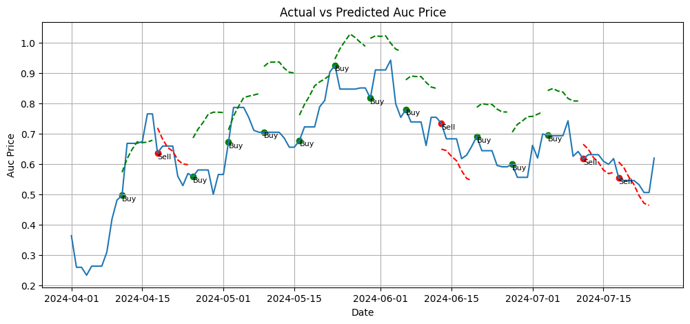
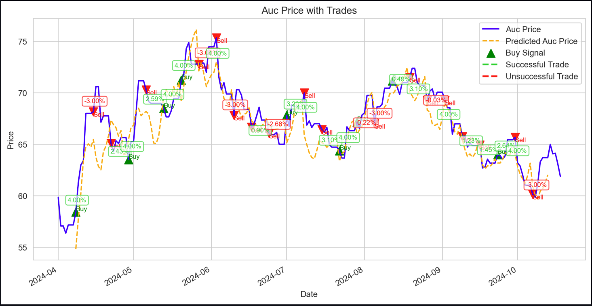
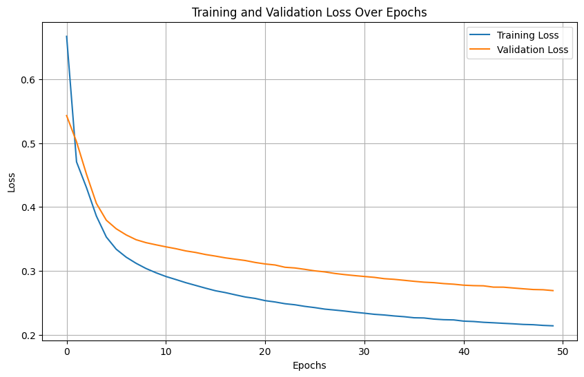
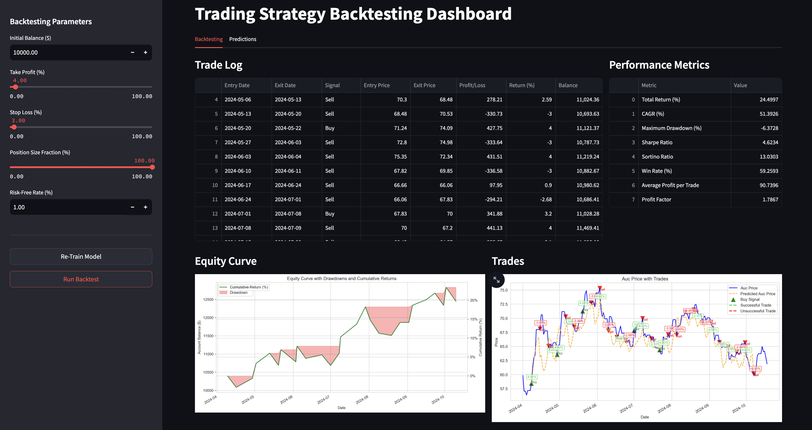
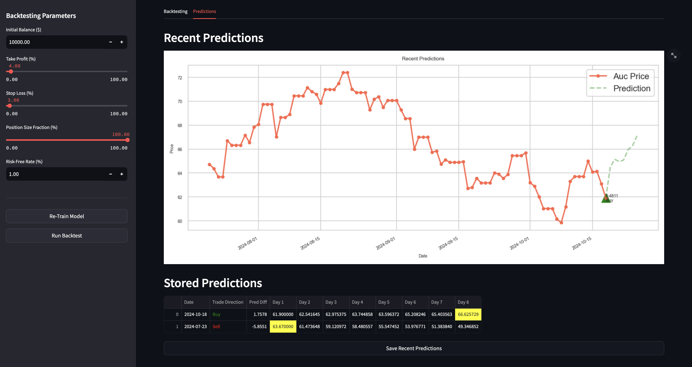

# Carbon Market Forecasting

<!--   -->
<!--  -->

## Overview

The feature engineering process is designed to enrich the original dataset from carbon market auctions, aiming to enhance the forecasting accuracy of subsequent modeling, particularly using LSTM networks. This comprehensive procedure involves the creation of various derived features that capture different market dynamics, temporal patterns, and interactions between variables.

## Modeling Approach

A window-based approach is employed for the prediction task, using a specified number of past time steps to forecast future auction prices. An LSTM model, adept at handling sequence data, is trained and validated with these windowed datasets. The forecasting process is sequential: the model predicts a set of future steps, shifts the window forward by the same number of steps, and repeats the prediction, covering the entire test set. The performance is evaluated by comparing actual vs. predicted prices, providing insights into the model’s accuracy and effectiveness in capturing market dynamics.

## Results

<!-- ### Multi-Step LSTM Model
 -->

### Multi-Step Convolution Model

<!-- ### Conv Model Training Curve
 -->

### Back Testing Dashboard

### Recent Predictions Tab

## Details of Feature Engineering

#### Time-Based Enhancements
- **Day, Month, Quarter**: Extracts calendar-based attributes from the date to capture seasonal and periodic market behaviors.

#### Statistical Features
- **Rolling Statistics**: Computes moving averages and standard deviations over different periods (7 and 30 days) for key financial metrics such as auction price, median price, and spot value. These features help in understanding trends and volatility over time.
- **Exponential Moving Averages (EMA)**: Provides a weighted average that gives more significance to recent data points, useful for detecting price trends.

#### Price Dynamics
- **Percentage Changes and Rate of Change**: These features measure the rate at which key price indicators are changing, providing insights into market momentum and potential reversals.
- **Ratio-Based Features**: Ratios such as auction to median price ratios offer a relative measure of prices, highlighting discrepancies or alignments in market valuation.

#### Volatility and Trend Indicators
- **Bollinger Bands**: A volatility indicator that provides a relative view of high and low prices, useful for identifying breakouts or contractions in market prices.
- **Simple Moving Averages and Crosses**: Used to detect the direction of the price trend and potential bullish or bearish crossovers.
- **MACD (Moving Average Convergence Divergence)**: A trend-following momentum indicator that shows the relationship between two moving averages of prices.

#### Technical Indicators
- **RSI (Relative Strength Index)**: Measures the speed and change of price movements to identify overbought or oversold conditions.
- **Seasonal Decomposition**: Attempts to decompose the auction price into seasonal, trend, and residual components, though contingent on successful calculation.

#### Interaction and Complex Features
- **Lagged Features**: Includes previous values of key variables to incorporate historical data points into the model.
- **Multiplicative and Additive Interactions**: Combines different market indicators in both multiplicative and additive forms to capture complex interdependencies.
- **Technical and Time-Based Interactions**: Integrates price data with technical indicators and time-based features to explore deeper relationships.

#### Additional Constructs
- **Squared and Ratio Interactions**: These features aim to capture non-linear relationships and more intricate market dynamics.
- **Normalization**: Standardizes numerical features to have zero mean and unit variance, ensuring that the model treats all features with equal importance during training.

### To Do / Improvements
- [x] Convert scaled auction prices back to actual prices.
- [x] Change TP and SL to percentage of the actual price.
- [x] Package functions for integration into the Streamlit dashboard.
- [x] Enhance the logic for loading models and making predictions.
- [x] Resolve issues related to saving and loading models from the designated directory.
- [ ] Conduct testing on the Autoformer model.

