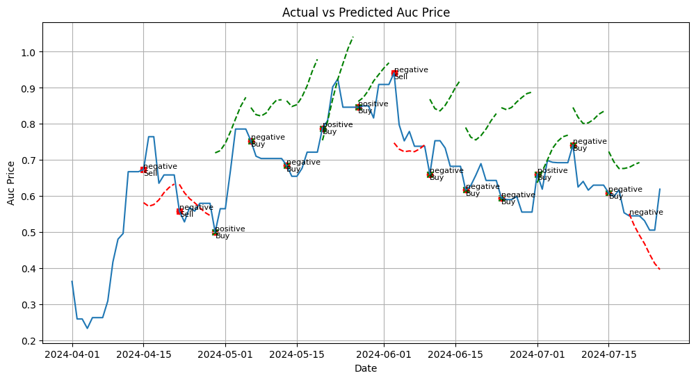

# Carbon Market Forecasting

The task involves forecasting the auction prices in carbon markets using historical data. The data is first fetched, cleaned, and preprocessed, which includes filling missing values and engineering new features. The data is then split into training, testing, and validation sets, and normalized.

A window-based approach is used for the prediction task, where a window of a certain width (number of time steps) is used to predict the prices for a certain number of future time steps. A Long Short-Term Memory (LSTM) model, which is a type of Recurrent Neural Network (RNN), is used for the forecasting task. The LSTM model is trained on the training data and validated on the validation data.

The model's performance is evaluated by plotting the actual vs. predicted auction prices on the test data. The prediction is done sequentially, where the model makes predictions for a certain number of future time steps, then moves the window forward by the same number of steps, and makes the next set of predictions. This process is repeated until predictions are made for the entire test set.